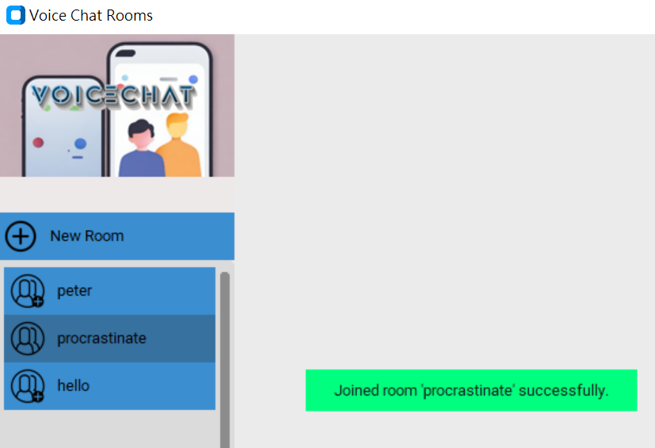

# csci3280_2

> [!NOTE]
> Developer may need to call their ```pip install -r requirements.txt``` again after this update to support the use of fancier GUI through the ```customtkinter``` package. <br>
>   - For more references on how to use this package, please refer to https://github.com/TomSchimansky/CustomTkinter.<br>
>   - But actually you can still stick with the normal ```tkinter``` for basic UI.

> [!IMPORTANT]
> Please refer to ```JobAllocation.md``` for the latest (potential) bugs yet to be fixed.

## Installation

To install this package, perform the following:

1) Execute ```pip3 install -r requirements.txt``` in command prompt.

Note:

1) The application currently only work with computers _in the same local area network_ due to port forwarding. 

> [!IMPORTANT]
> 2) Please TURN OFF Windows Defender Firewall AND Windows Firewall (or any firewalls) in the private network before using.

## Server-Side
To start the server, perform the following:

1) Run ```chat_server.py``` by calling ```python chat_server.py --port <port>```. 

    - Use the token ```-h``` to get hints on the arguments.
    - Use the token ```-l``` to show logs of all communication between server and client.
    - Press ```Ctrl+C``` for the following:
        - check the ip and port of the server, or
        - terminate the server

Notes:

1) You should be able to read the server IP and the port as follows: 
`Initializing Chat Server at IP [10.13.252.5] and port [12345]`

2) You can terminate the server end program and all its associated connections by pressing ```Ctrl+C``` in the command prompt.

## Client-Side
To start the client-side software, perform the following: 

1) Run ```chat_client.py``` by calling ```python chat_client.py --ip <ip> --port <port>```, where the IP and port can be read from the server side.

    - Use the token ```-h``` to get hints on the arguments.
    - Use the token ```-l``` to show logs of all communication between server and client.

<details>
<summary>Functionalities:</summary>

1) Users can click on 'new room' button to enter the name of the room now.

2) users can click on the room names to join the room directly now.


</details>

## Logs

<details>
<summary>Example of server side log:</summary>

    Initializing Chat Server at IP [10.13.252.5] and port [12345]
    Starting server...
    Accepted request from: 10.13.252.5 port 1749
    I/list                  : 10.13.252.5 1749      : {'action': 'list'}
    O/list_rooms            : 10.13.252.5 1749      : {'rooms': []}
    I/create                : 10.13.252.5 1749      : {'action': 'create', 'room': 'hello'}
    O/created_room          : 10.13.252.5 1749      : {'status': 'ok', 'room': 'hello'}
    I/list                  : 10.13.252.5 1749      : {'action': 'list'}
    O/list_rooms            : 10.13.252.5 1749      : {'rooms': ['hello']}
    I/create                : 10.13.252.5 1749      : {'action': 'create', 'room': 'world'}
    O/created_room          : 10.13.252.5 1749      : {'status': 'ok', 'room': 'world'}
    I/list                  : 10.13.252.5 1749      : {'action': 'list'}
    O/list_rooms            : 10.13.252.5 1749      : {'rooms': ['hello', 'world']}
    I/join                  : 10.13.252.5 1749      : {'action': 'join', 'room': 'world'}
    O/join_room             : 10.13.252.5 1749      : {'status': 'room already joined', 'room': 'world'}
    I/exit                  : 10.13.252.5 1749      : {'action': 'exit'}
    Ended request from: 10.13.252.5 port 1749
    Accepted request from: 10.13.252.5 port 1819
    I/list                  : 10.13.252.5 1819      : {'action': 'list'}
    O/list_rooms            : 10.13.252.5 1819      : {'rooms': ['hello', 'world']}
    Accepted request from: 10.13.252.5 port 1829
    I/list                  : 10.13.252.5 1829      : {'action': 'list'}
    O/list_rooms            : 10.13.252.5 1829      : {'rooms': ['hello', 'world']}
    I/exit                  : 10.13.252.5 1829      : {'action': 'exit'}
    Ended request from: 10.13.252.5 port 1829
    I/exit                  : 10.13.252.5 1819      : {'action': 'exit'}
    Ended request from: 10.13.252.5 port 1819

</details>

<details>
<summary>Example of client side log:</summary>

    O/list                  : {'action': 'list'}
    I/list_rooms            : {'rooms': ['hello', 'world']}
    O/create                : {'action': 'create', 'room': 'room 4'}
    O/list                  : {'action': 'list'}
    I/created_room          : {'status': 'ok', 'room': 'room 4'}
    Room 'room 4' created successfully.
    I/list_rooms            : {'rooms': ['hello', 'world', 'room 4']}
    O/join                  : {'action': 'join', 'room': 'world'}
    I/join_room             : {'status': 'ok', 'room': 'world'}
    Joined room 'world' successfully.
    O/join                  : {'action': 'join', 'room': 'world'}
    I/join_room             : {'status': 'room already joined', 'room': 'world'}
    Room already joined.
    O/create                : {'action': 'create', 'room': 'room 4'}
    O/list                  : {'action': 'list'}
    I/created_room          : {'status': 'room already exists', 'room': 'room 4'}
    Failed to create room.
    I/list_rooms            : {'rooms': ['hello', 'world', 'room 4']}
    
</details>